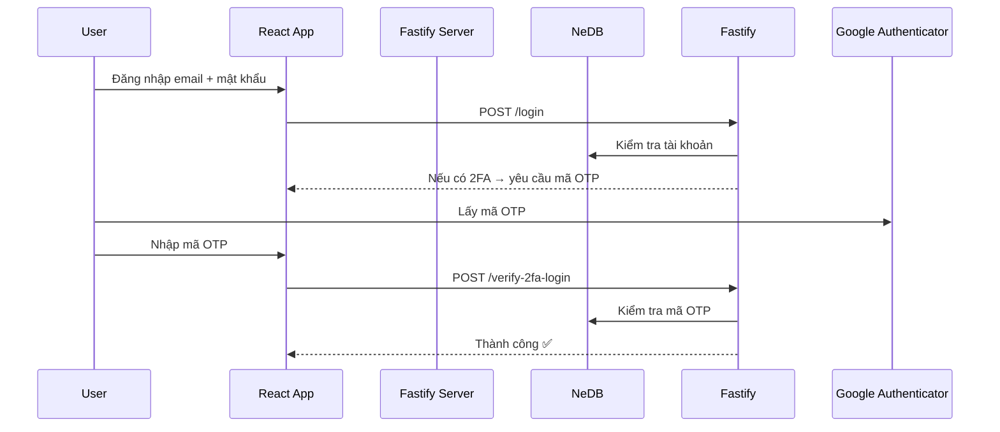

# 🔐 Two-Factor Authentication (2FA) App - React + Fastify

Dự án mô phỏng hệ thống xác thực 2 bước (2FA - Two-Factor Authentication) **thực tế**, giúp tăng bảo mật khi đăng nhập.

- ✅ Đăng ký / Đăng nhập
- ✅ Kích hoạt / Xác minh 2FA bằng Google Authenticator
- ✅ Quét mã QR để bật xác thực OTP
- ✅ Quản lý session đăng nhập (đa thiết bị)
- ✅ Có thể tắt 2FA bất kỳ lúc nào

---

## 🧱 Công nghệ sử dụng

### 💻 Frontend

| Tech             | Vai trò                   |
| ---------------- | ------------------------- |
| **React**        | Xây dựng giao diện        |
| **TypeScript**   | Kiểm soát kiểu dữ liệu    |
| **React Router** | Điều hướng giữa các trang |

### 🛠 Backend

| Tech                     | Vai trò                          |
| ------------------------ | -------------------------------- |
| **Fastify**              | Web framework siêu nhẹ và nhanh  |
| **TypeScript**           | Strict typing                    |
| **NeDB (nedb-promises)** | Cơ sở dữ liệu giả lập (local)    |
| **bcrypt**               | Mã hóa mật khẩu                  |
| **otplib**               | Tạo & xác thực mã 2FA (TOTP)     |
| **qrcode**               | Sinh QR code để quét vào app 2FA |

---

## 🔐 Các chức năng chính

### 👤 Xác thực người dùng

- `POST /register`: Đăng ký tài khoản mới
- `POST /login`: Đăng nhập, nếu bật 2FA thì cần thêm bước xác minh

### 🔑 2FA

- `POST /enable-2fa`: Kích hoạt 2FA → server sinh QR code
- `POST /verify-2fa-setup`: Xác minh mã OTP từ Google Authenticator
- `POST /verify-2fa-login`: Xác minh mã OTP khi đăng nhập
- `POST /disable-2fa`: Tắt 2FA
- `GET /validate-session/:sessionId`: Kiểm tra session hiện tại

### 🚪 Logout

- `POST /logout`: Xóa session

---

## 📱 Luồng sử dụng 2FA

